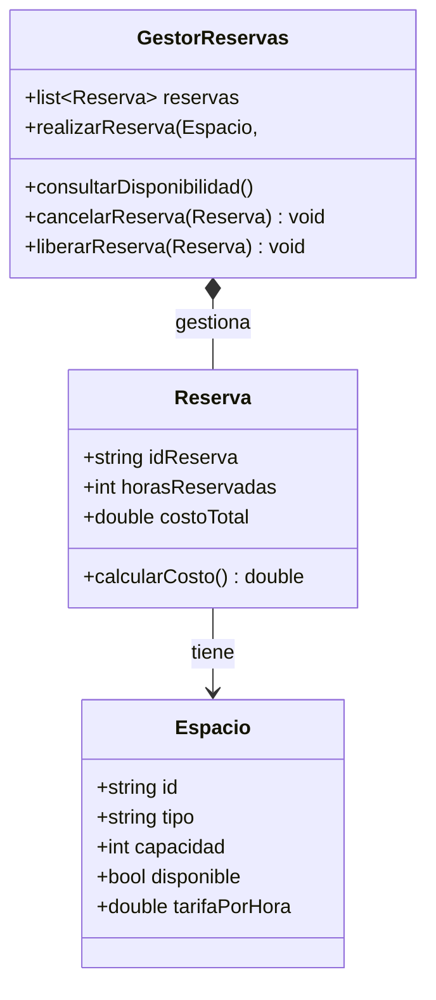

#SANTIAGO MONCAYO, ALEXANDER BOTELLO, ALESSANDRO GOMEZ

##### A. Identificación de errores en un diseño

##### Diseño 1 error
la asociación entre espacio y reserva es el problema ya que la relación debe ser desde reserva hacia espacio, no al revés.
Falta el método para liberar reservas, falta el atributo para el costo total en Reserva y Falta el relación entre GestorReservas y Reserva.

##### Diseño 2 error

el problema de la grafica 2 es parecido a la de la 1 porque la dirección de la asociación entre espacio y reserva debería ser una composición desde reserva hacia espacio no al revés.
Falta de método para consultar disponibilidad, Falta el método para liberar reservas y Falta el atributo para el costo total en Reserva

##### Diseño 3 error
Tambien seria la dirección de la asociación entre espacio y reserva al igual que los anteriores la flecha debe ir desde reserva hacia espacio. Este es el mas completo
Falta el método para consultar disponibilidad en GestorReservas.

##### Diseño corregido



##### B. Ejercicios de Diseño y codificación

##### Diseño propuesto para la Gestión de un Centro de Reciclaje Comunitario

```mermaid
classDiagram
    class Ciudadano {
        -nombre
        -puntos
        +registrarEntrega(material: Material, peso: float)
        +consultarPuntos()
        +canjearPuntos(puntosCanjeados: int)
    }

    class Material {
        -tipo
        -peso 
        -puntosPorKg
    }

    class Empleado {
        -nombre: string
        +registrarCiudadano(ciudadano: Ciudadano)
        +registrarEntrega(ciudadano: Ciudadano, material: Material, peso: float)
    }

    class CentroReciclaje {
        -ciudadanos: list<Ciudadano>
        -empleados: list<Empleado>
        +agregarCiudadano(ciudadano: Ciudadano)
        +agregarEmpleado(empleado: Empleado)
    }

    Ciudadano --  Material : Entrega
    Empleado  --  Ciudadano : Registra
    CentroReciclaje --  Ciudadano : Contiene
    CentroReciclaje --  Empleado : Contiene
    ```