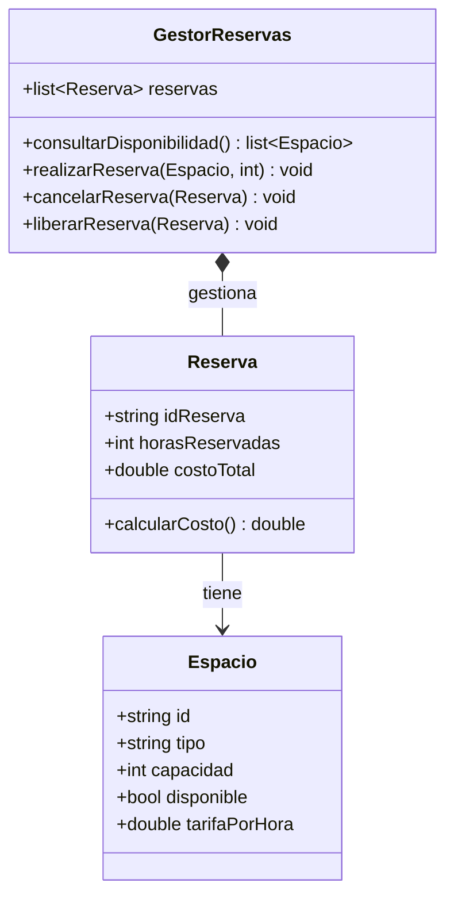

#SANTIAGO MONCAYO, ALEXANDER BOTELLO, ALESSANDRO GOMEZ

##### Diseño 1 error
la asociación entre espacio y reserva es el problema ya que la relación debe ser desde reserva hacia espacio, no al revés.
##### Diseño 2 error

el problema de la grafica 2 es parecido a la de la 1 porque la dirección de la asociación entre espacio y reserva debería ser una composición desde reserva hacia espacio no al revés.

##### Diseño 3 error
Tambien seria la dirección de la asociación entre espacio y reserva al igual que los anteriores la flecha debe ir desde reserva hacia espacio. Este es el mas completo

##### Diseño corregido

